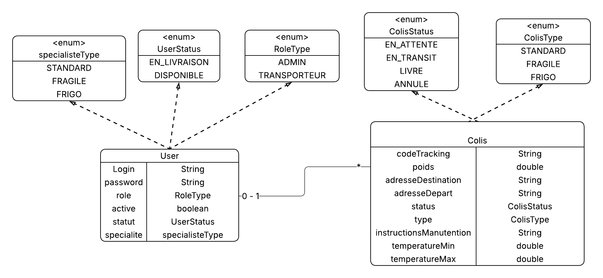

# 🏔️ Everest Logistics - Intelligent Freight Management System


> **A robust backend platform for modern logistics operations, managing the complete parcel lifecycle with polymorphic architecture and advanced security.**

---

## 📖 Project Overview

**Everest Logistics** is a RESTful API solution designed to modernize freight operations. Unlike traditional rigid systems, this project leverages the **flexibility of MongoDB** to handle various parcel types (Standard, Fragile, Refrigerated) within a unified architecture.

The system features a **"Smart Dispatching"** engine that enforces strict business rules, ensuring that specialized parcels (e.g., Cold Chain) are entrusted only to qualified transporters equipped for the task.

### 🚀 Key Features

* **📦 Polymorphic Parcel Management:**
    * **Standard:** Basic logistics data (Weight, Address).
    * **Fragile:** Specific handling instructions.
    * **Frigo (Refrigerated):** Strict temperature control tracking (Min/Max).
* **🧠 Smart Dispatching Algorithm:**
    * **Strict Matching:** A `FRIGO` transporter can only take `FRIGO` parcels.
    * **Universal Fallback:** `STANDARD` parcels can be assigned to any fleet member to optimize utilization.
* **🔒 Security & RBAC (Role-Based Access Control):**
    * **Stateless Authentication** using JWT.
    * **Role Separation:** **ADMIN** (Full Control) vs **TRANSPORTEUR** (Scoped Operations).
* **⚙️ Technical Excellence:**
    * **Global Exception Handling** for clean API responses.
    * **Input Validation** (@Valid) at entry points.
    * **CI/CD Pipeline** automated via GitHub Actions.

---

## 🏗️ Architecture & Design

### 1. Use Case Diagram
Illustrates the interaction between the Admin (Manager) and the Transporter within the system boundaries.


### 2. Class Diagram
Highlights the use of **Enums** and **Polymorphism** to model the flexible data schema.



---

## 🛠️ Tech Stack

| Category | Technologies |
| :--- | :--- |
| **Backend** | Java 17, Spring Boot 3, Spring Security |
| **Database** | MongoDB (NoSQL Flexible Schema) |
| **DevOps** | Docker, Docker Compose, GitHub Actions |
| **Testing** | JUnit 5, Mockito |
| **Build Tool** | Maven |

---

## ⚡ Getting Started

No need to install Java or MongoDB locally. The entire stack is containerized!

### Prerequisites
* Docker & Docker Compose installed.

### Installation & Execution

1.  **Clone the repository:**
    ```bash
    git clone https://github.com/ChehAchraf/everest.git
    cd everest
    ```

2.  **Build & Run (One-Command):**
    This command compiles the code, builds the Docker image, and starts the containers (App + Mongo).
    ```bash
    docker-compose up --build
    ```

3.  **Access the API:**
    * Base URL: `http://localhost:8080/api`
    * Swagger UI (Documentation): `http://localhost:8080/swagger-ui.html`

---

## 🔌 API Endpoints (Overview)

### 👮 Admin Space (Requires Admin Token)

| Method | Endpoint | Description |
| :--- | :--- | :--- |
| `POST` | `/api/admin/colis` | Create a new parcel (Standard, Frigo, Fragile). |
| `PUT` | `/api/admin/colis/{id}` | Update parcel details. |
| `POST` | `/api/admin/colis/{id}/assign/{livreurId}` | Assign parcel to transporter (Validates specialty). |
| `GET` | `/api/admin/transporteurs` | List transporters (Filter by specialty available). |
| `PUT` | `/api/admin/transporteurs/{id}` | Update transporter details. |
| `PATCH` | `/api/admin/users/{id}/status` | Activate / Deactivate a user account. |

### 🚚 Transporter Space (Requires Transporter Token)

| Method | Endpoint | Description |
| :--- | :--- | :--- |
| `GET` | `/api/transporteur/colis` | View only my assigned parcels. |
| `PATCH` | `/api/transporteur/colis/{id}/status` | Update delivery status (e.g., EN_TRANSIT -> LIVRE). |

---

## 🧪 Testing & Quality Assurance

The project maintains high code quality standards through unit testing (JUnit/Mockito), covering critical business logic:
* ✅ **Parcel Service:** Verifies that the "Type vs Specialty" matching rule is enforced.
* ✅ **Exceptions:** Ensures correct error handling for illegal assignments.

To run tests manually:
```bash
mvn test

